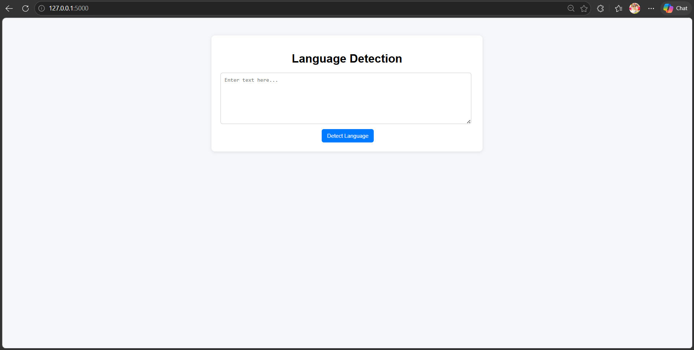

# 🌍 Language Detection System

A Machine Learning + NLP based web application that detects the language of input text in real-time.

---

## 🚀 Features
- 🌐 Detects multiple languages from text input
- ⚡ Real-time prediction using trained ML model
- 🧠 Character n-gram + TF-IDF based feature extraction
- 📜 Session-based history tracking
- 🖥️ Clean and simple user interface (Flask)

---

## 🛠️ Tech Stack
- Python
- Scikit-learn
- Flask
- HTML, CSS
- JavaScript (for dynamic updates)

---

## 📸 Interface

<p align="center">
  
</p>

---

## ⚙️ How to Run Locally

```bash
git clone https://github.com/sumittripathi8341-ui/Language-Detection-System
cd Language-Detection-System
pip install -r requirements.txt
python app.py